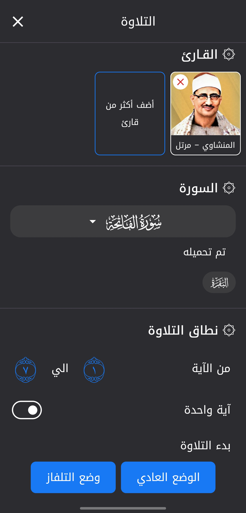
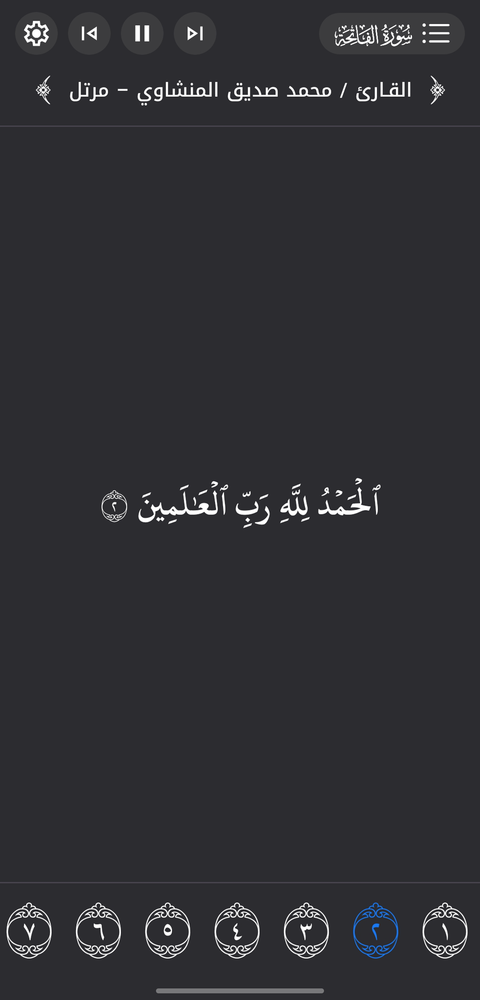
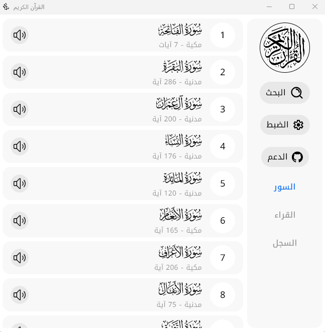
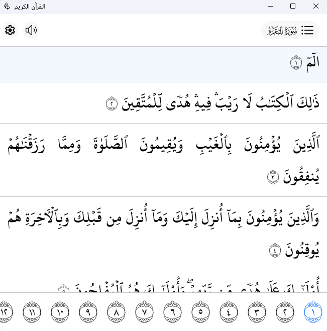
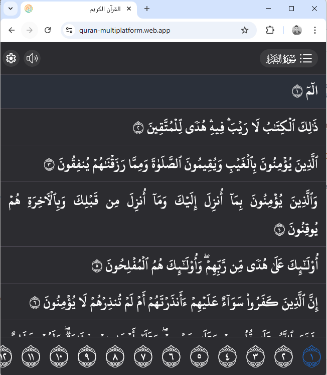
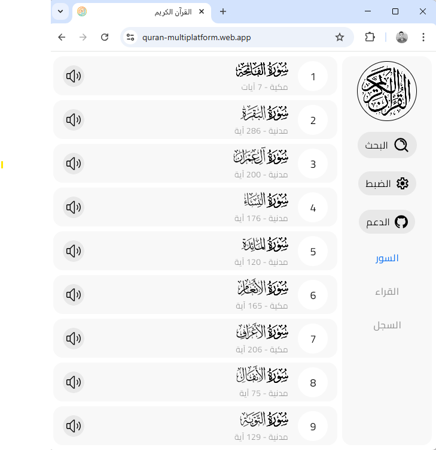
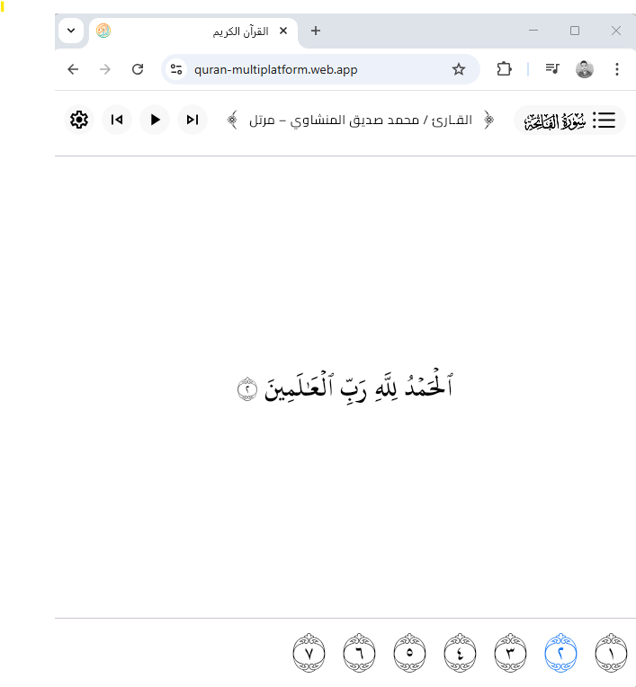
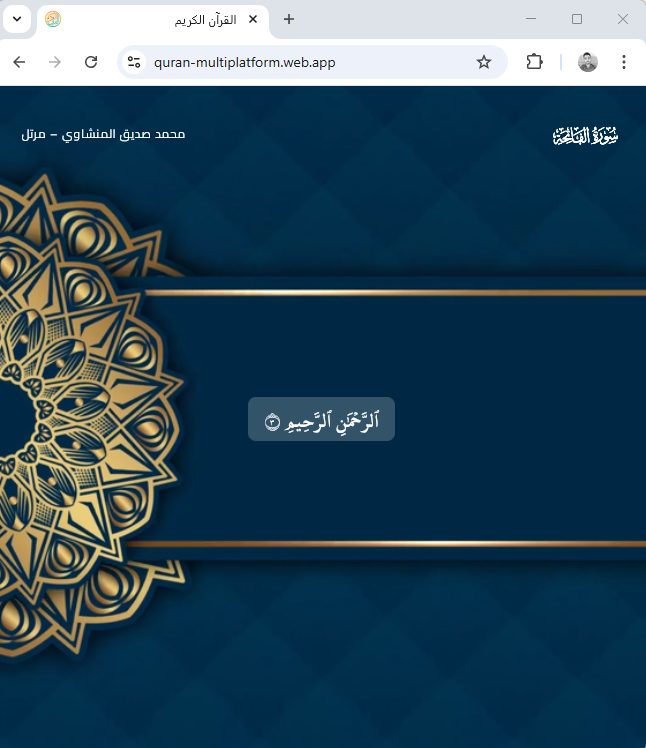

# Quran App - تطبيق القرآن الكريم

## 📥 Download التحميل

- 🤖 [Android (Google Play)](https://play.google.com/store/apps/details?id=com.ma7moud3ly.quran)
- 🍎 iOS (App Store) *(coming soon)*
- 🌐 [Web Version](https://quran-multiplatform.web.app/)
- 📦 [Latest Release (GitHub)](https://github.com/ma7moud3ly/quran-multiplatform/releases)

---

✨ Quran App: A free and open-source cross-platform application for mobile, web, and desktop that allows simplified and smooth reading of the Quran and listening to recitations from dozens of well-known reciters.

✨ تطبيق القران الكريم: تطبيق مجاني ومفتوح المصدر متعدد المنصات يعمل علي الموبايل والويب وسطح المكتب ويتيح قراءة القراءن بشكل مبسط وسلس وسماع العديد من القراء المعروفين
.
<image src="images/banner.png">

### Application Features:
🎧 Listen live or download recitations for offline listening.  
📜 Display verses continuously, separately, or one verse at a time, according to your choice.  
🎤 Play recitations in multi-reciter mode, enabling you to hear the same verses by different reciters or switch between reciters with each verse.  
🌟 A distinctive recitation display system with wonderful backgrounds and videos for an enjoyable and engaging reading and listening experience.  
🖥️ Simple and easy-to-use interface to make the experience of reading the Quran pleasant and calm.

### مميزات التطبيق:
🎧 استماع مباشر أو تحميل التلاوات للاستماع بدون إنترنت.  
📜 عرض الآيات بشكل متصل، منفصل، أو آية واحدة حسب اختيارك.  
🎤 تشغيل التلاوة في وضع متعدد القراء يمكنك من سماع نفس الآيات بعدة قراء مختلفين أو التبديل بين القراء مع كل آية.  
🌟 نظام عرض التلاوة بشمل مميز بخلفيات وفيديوهات مميزة.  
🖥️ واجهة بسيطة وسهلة الاستخدام لتجعل تجربة قراءة القرآن ممتعة وهادئة.


---

## Technologies Used

This application is built using a modern technology stack, leveraging the power of Kotlin and Jetpack Compose for a shared UI across multiple platforms.

**Core Technologies:**

- **Kotlin Multiplatform (KMP):** Enables sharing business logic and data layers across Android, iOS, Desktop (JVM), and Web (WasmJs).
- **Jetpack Compose Multiplatform:** A declarative UI toolkit for building native interfaces across different platforms with a shared codebase.

**Key Libraries & Frameworks:**

- **Clean Architecture:** The app follows a layered architecture divided into:
  - **View:** UI built with Jetpack Compose.
  - **ViewModel:** Handles UI state and business logic.
  - **Data:** Responsible for repositories, network, and storage.
  - **Model:** Core entities and domain logic.
- **UI & Navigation:** Jetpack Compose libraries for building UI and navigation.
- **Dependency Injection:** Koin for managing dependencies.
- **Data Handling & Storage:** Kotlinx libraries for datetime, serialization, and [settings](https://github.com/russhwolf/multiplatform-settings).
- **Networking:** Ktor as the HTTP client across platforms.
- **File System & I/O:** Okio for efficient I/O operations.
- **Media Playback:** ExoPlayer (Android) and MP3SPI (Desktop).
- **Firebase (GMS Flavor):** Crashlytics and Analytics support.


---

## Supported Platforms & Builds

This application is designed to run on multiple platforms. Below are the details for each supported build type and how to build them.

### General Build Setup

Before building for any platform, ensure you have the following prerequisites installed:

1. **Android Studio (recommended):** The easiest way to build, run, and debug the project across all supported platforms.
2. **Java Development Kit (JDK):** Version 17 or higher.
3. **Gradle:** Already bundled with Android Studio, or use the included Gradle wrapper (`./gradlew`).

---

### Android

The Android app provides a native experience on Android devices and tablets.

**Dark Mode:**
<div>

&nbsp;&nbsp;&nbsp;

&nbsp;&nbsp;&nbsp;

</div>

**Light Mode:**
<div>

&nbsp;&nbsp;&nbsp;

&nbsp;&nbsp;&nbsp;

</div>

**Tablet:**
<div>

&nbsp;&nbsp;&nbsp;

</div>
<br><br>

**How to Build (APK):**

- **Default flavor (without Firebase):**
```bash
./gradlew assembleDefaultDebug   # Debug build
./gradlew assembleDefaultRelease # Release obfuscated build
```
- **GMS flavor (with Firebase Crashlytics & Analytics):**

Requires google-services.json to be placed at:
```composeApp/src/gms/google-services.json```

```bash
./gradlew assembleGmsDebug    # Debug build with Firebase
./gradlew assembleGmsRelease  # Release obfuscated build with Firebase
```

- **Output APKs:**
  All APKs will be located in:
  ```composeApp/build/outputs/apk/[flavor]/```

### Desktop (JVM - Linux, Windows, macOS)

The app can be packaged into platform-specific installers (`.deb`, `.exe`, `.dmg`) for desktop.

**Light Mode:**
<div>

&nbsp;&nbsp;&nbsp;

&nbsp;&nbsp;&nbsp;

</div>

**How to Build:**

```bash
./gradlew packageReleaseDeb  # Linux (.deb)
./gradlew packageReleaseExe  # Windows (.exe)
./gradlew packageReleaseDmg  # macOS (.dmg)
```

Outputs will be in:  
`composeApp/build/compose/binaries/main-release/[deb|exe|dmg]/`

---

### Web (WasmJs)

The app can be built for the web using WebAssembly (WasmJs),  
allowing it to run directly in modern browsers without plugins.

**Dark Mode:**
<div>

&nbsp;&nbsp;&nbsp;

&nbsp;&nbsp;&nbsp;

</div>

**Light Mode:**
<div>

&nbsp;&nbsp;&nbsp;

&nbsp;&nbsp;&nbsp;

</div>

**How to Build:**

```bash
./gradlew wasmJsBrowserDistribution
```

Output will be in:  
`composeApp/build/dist/wasmJs/productionExecutable/`

---

### iOS (Planned)

iOS support is planned for the future using Kotlin Multiplatform.

---

## Optional: Signing Configuration

For signing builds (optional), place your keystore files inside a `keys/` directory at the project root. Then configure signing credentials inside `local.properties` as follows:

```properties
DEBUG_STORE_FILE=../keys/debug.keystore
DEBUG_STORE_PASSWORD=
DEBUG_KEY_ALIAS=
DEBUG_KEY_PASSWORD=

RELEASE_STORE_FILE=../keys/release.keystore
RELEASE_STORE_PASSWORD=
RELEASE_KEY_ALIAS=
RELEASE_KEY_PASSWORD=
```

- `debug.keystore` → used for local/debug builds.
- `release.keystore` → used for production/release builds.

> **Security note:** Avoid committing `local.properties` or keystore files to version control.

---

## CI/CD Automation

For continuous integration and deployment, please check the **Fastlane** and **GitHub Actions** scripts included in the project.  
They handle environment setup, signing, and automated publishing workflows.

---

## Resources and Inspirations

- **Quran Text:** [Risan's Quran JSON](https://github.com/risan/quran-json/tree/main), [Quran CDN](https://cdn.jsdelivr.net/npm/quran-json@3.1.2/dist/chapters/index.json)
- **Fonts and Symbols:** [King Fahd Complex](https://qurancomplex.gov.sa/en/techquran/dev/), [Amiri Quran Font](https://t.me/s/quranfont/78), [Qul Tarteel AI](https://qul.tarteel.ai/resources/)
- **Recitations and Audio:** [Archive.org](https://archive.org/details/Ay4574357345757atWin), [KSU Ayat Project](https://quran.ksu.edu.sa/ayat/)
- **Videos and Backgrounds:** [Pixabay - natsu_444](https://pixabay.com/users/natsu_444-37854495/), [Pixabay - mosque_ai](https://pixabay.com/users/mosque_ai-50397212/)
- **Design Inspiration:** [Islamhouse MP3 Figma](https://www.figma.com/design/uFynscVz9MYU5NAWkhPHO1/islamhouse-mp3?node-id=143-6495&p=f&t=TCoVWBzjlA0nxIkr-0)
- **Logo:** [FreeSVG - Quran Vector](https://freesvg.org/logo-quran-arabic-calligraphy-islamic-vector)

---

## Contributing

Contributions are welcome! If you'd like to contribute, please fork the repository and submit a pull request.  
For major changes, please open an issue first to discuss what you would like to change.

---

## License

This project is licensed under the terms described in the [LICENSE](LICENSE) file.
